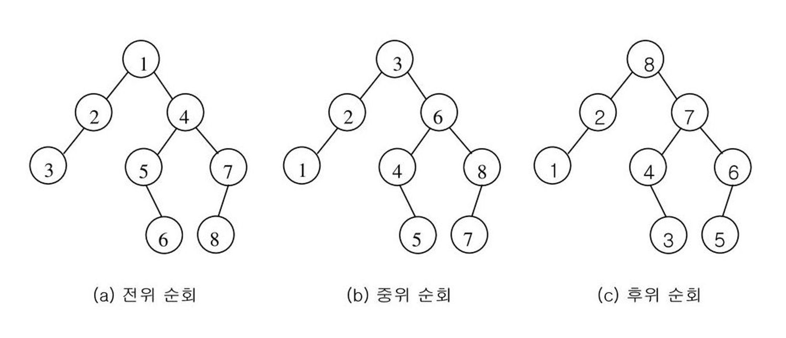
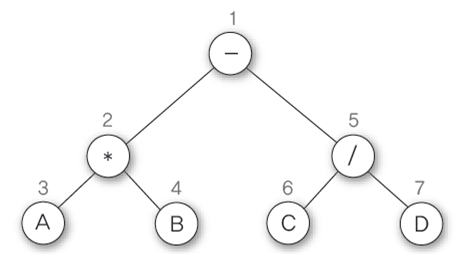
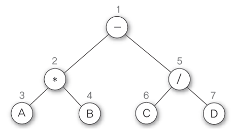
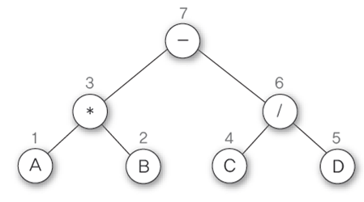
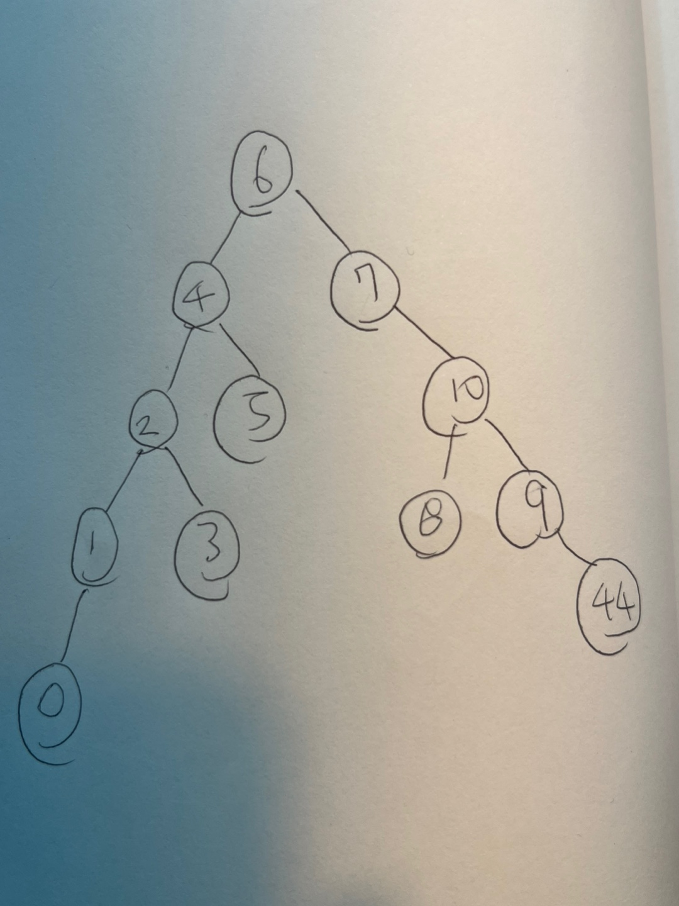

# 이진 트리
이진트리란 자식노드가 최대 두개인 노드들로 구성된 트리입니다. 이진트리에는 정이진트리(full binary tree),완전이진트리(complete binary tree), 균형이진트리(balanced binary tree)등이 있습니다.


## Full 이진 트리
각 노드가 0개 혹은 2개의 자식 노드를 갖는다.

## Complete 이진 트리
마지막 레벨을 제외한 모든 노드가 가득 차 있어야 한다. 마지막 레벨의 노드는 전부 차 있지 않아도 되지만 왼쪽이 채워져야 한다.

## Perfect 이진 트리
모든 리프 노드의 레벨이 동일하고, 모든 레벨이 가득 채워져 있는 트리

# 이진 탐색 트리
왼쪽 서브트리의 모든 값은 부모의 값보다 작고 오른쪽 서브트리의 모든 값은 부모의 값보다 큰 이진트리이다.
해시와는 다르게 원소가 크기 순으로 정렬되어 있다. 해시라는 구조자체가 원소를 크기 순으로 저장하는 자료구조가 아니다.
따라서, insert, erase, find, update 등이 빈번히 일어나면서 동시에 원소의 대소와 관련한 성질이 필요한 경우에는 이진 검색트리가 필요하다.

## 이진 탐색 트리의 문제점
균형 잡힌 트리가 아닐때, 입력되는 값의 순서에 따라 한쪽으로 노드들이 몰릴 수 있다. 이때, 연결리스트와 비슷한 구조가 되어 최악의 경우 탐색시 시간복잡도가 O(N)으로 늘어날 수 있다.

균형 잡힌 트리가 아닐 때 트리 탐색 문제를 해결하기 위해 트리의 구조를 재조정하는 과정을 거치는 알고리즘을 추가할 수 있다.
## 이진 검색트리의 시간복잡도
insert, erase, find, update => O(logN)

### Insert
현재 바라보고 있는 노드의 값과의 대소비교를 통해 빈 공간을 찾을 때까지 왼쪽 혹은 오른쪽으로 이동하기

### Find
현재 바라보고 있는 노드의 값과의 대소비교를 통해 특정 노드를 찾을 때 까지 왼쪽 혹은 오른쪽으로 이동하기

### Erase
자식이 없는 노드를 지울 때 => 그냥 지워도 구조를 유지
자식이 1개인 노드를 지울 때 => 자식 노드의 위치를 지우는 노드위치로 이동해도 구조 유지
자식이 2개인 노드를 지울 때 => 지우고 싶은 노드의 값에서 오른쪽 자식을 보고, 거기서부터 계속 왼쪽으로만 가면된다.
(지우고 싶은 노드보다 큰 노드 중 가장 작은 값으로 대체)

### Update
Find 실행 이후 해당 값을 변경 => 변경 이후 트리 구조를 올바르게 재배치

# 트리의 탐색방법

### 전위 순회
자기 자신 처리(루트)=> 왼쪽 자식 방문 => 오른쪽 자식 방문

A*B-C/D라는 수식을 전위 순회로 트리를 만들면 위와 같다.
순회경로: -*AB/CD
- A*B 계산 => C/D 계싼 => 두 값을 - 계산

### 중위순회
왼쪽 자식 방문 => 자기 자식 처리(루트) => 오른쪽 자식 방문

A*B-C/D라는 수식을 중위 순회로 트리를 만들면 위와 같다.
순회경로: A*B-C/D
### 후위순회
왼쪽 자식 방문 => 오른쪽 자식 방문 => 자기 자신 처리(루트)

A*B-C/D라는 수식을 후위 순회로 트리를 만들면 위와 같다.
순회경로: AB*CD/-
# 구현
## 이진탐색트리 ADT
### Node Class
설명: value와 left, right로 구성된 객체
필드
- value: Node가 가진 값
- left: Node보다 작은 value를 가진 Node
- right: Node보다 큰 value를 가진 Node

### Binary Search Tree Class
설명: Node로 구성된 객체
***필드***
root: 0번 레벨의 노드
***메서드***
insert(value: T): BST에 value를 삽입한다.

```
pre: value = bst에 삽입할 value
post: value가 bst에 올바른 위치에 삽입된다.
newNode = new Node(value)
this.root === null
  this.root === newNode
else
  insertIntoCurrentNode(newNode)
return this
```
insertIntoCurrentNode(newNode): root부터 시작해서 새로운 node를 올바른 위치에 넣는다.
```
pre: newNode = 삽입할 노드
post: 새로운 노드를 bst의 올바른 위치에 삽입
recurInsert(currentNode)
  currentNode의 value > newNode의 value
    if(current.left === null) current.left = newNode
    else recurInsert(current.left)
  currentNode의 value < newNode의 value
    if(current.right === null) current.right = newNode
    else recurInsert(current.right)
  currentNode의 value === newNode의 value
  return
recurInsert(this.root)
return
```
contains(value): value가 bst에 있는지 확인
```
pre: value = 찾고자하는 노드의 value
post: value가 bst에 포함되어있는지 boolean값 반환

if(root === null) return false

recurContain(currentNode)
  if(currentNode.value === value) return true
    if(currentNode의 value > value)
      recurContain(current.left)
    else if (currentNode의 value < value)
      recurContain(current.right)
return recurContain(this.root)
```
find(value):value가 Node의 value인 Node를 찾기
```
pre: value = 찾고자하는 노드의 value
post: 찾고자하는 value를 value로 가지고 있는 Node를 반환

recurFind(currentNode)
  if(currentNode === null) return null
    if(currentNode의 value > value)
      return recurFind(current)
  else if(currentNode의 value < value)
      return recurFind(current)
  else // currentNode의 value === value
      return currentNode
return recurFind(this.root)
```
findMin(): bst에서 가장 작은 값 찾기
```
pre:
post: bst에서 가장 작은 value를 반환
if(this.root === null) return null
return findMinFromCurrent(this.root)
```
```
findMinFromCurrent(currentNode);
if (currentNode.left === null) return curretNode.value;
return findMinFromCurrent(currentNode.left);
```
findMax(): bst에서 가장 큰 값 찾기
```
pre:
post: bst에서 가장 큰 value를 반환
if(this.root === null) return null
return findMaxFromCurrent(this.root)
```
```
findMaxFromCurrent(currentNode);
if (currentNode.right === null) return curretNode.value;
return findMaxFromCurrent(currentNode.right);
```
findParent(value): 입력받은 value를 가진 Node의 부모 Node찾기
```
pre: value = 찾고자하는 Node
post: 찾고자하는 Node의 부모 Node

recurFindParent(currentNode)
  if(currentNode === null) return null
    if(currentNode의 value > value)
      if(current.left.value === value) return currentNode
      else recurFindParent(current.left)
    else if(currentNode의 value < value)
      if(current.right.value === value) return currentNode
      else recurFindParent(current.right)
    else // currentNode의 value === value
    return null
return recurFindParent(this.root)
```

delete(value): bst에서 value를 제거

자식이 없는 노드를 지울 때 → 그냥 지워도 구조를 유지

자식이 1개인 노드를 지울 때 → 자식노드의 위치를 지우는 노드위치로 이동해도 구조 유지

자식이 2개인 노드를 지울 때 → 지우고 싶은 노드의 값에서 오른쪽 자식을 보고, 거기서부터 계속 왼쪽으로만 가면된다. (지우고 싶은 노드보다 큰 노드 중 가장 작은 값으로 대체)

```
pre: value = 제거하고자하는 노드의 value
post: bst에서 value를 포함한 Node를 제거, bst가 올바른지 확인

if(!this.root) return

if(this.root.value === value)
  this.root = null
  return

parent = this.findParent(value)
if(!parent) return

current // 지우고자하는 타겟
if(parent.left.value === value)
  current = parent.left.value
else if(parent.right.value === value)
  current = parent.right.value

if(current.left === null && current.right === null) // 타겟의 자식 노드가 없을 때

else if(current.left === null) //
else if (current.right === null
```

순회

```
traversal()
  pre:
  post: 중위순회로 방문한 bst를 콘솔로 반환
  result: 결과를 담을 배열
    traversalRecur(currentNode)
    if(currentNode !== null)
      // 전위순회result.push(current.value)
      traversalRecur(currentNode.left)
      // 중위순회result.push(current.value)
      traversalRecur(currentNode.left)
      // 순휘순회result.push(current.value)
traversalRecur(this.root)
```

# 예제 실행결과
테스트코드에서 구현한 구조는 아래 그림과 같다.


# 참고자료
https://hanamon.kr/자료구조-탐색-tree-traversal-트리-순회/

https://velog.io/@porupit0122/JavaScript-자료구조-4-트리

https://ratsgo.github.io/data structure&algorithm/2017/10/21/tree/

https://github.com/trekhleb/javascript-algorithms/tree/master/src/data-structures/tree/binary-search-tree

https://mattlee.tistory.com/30