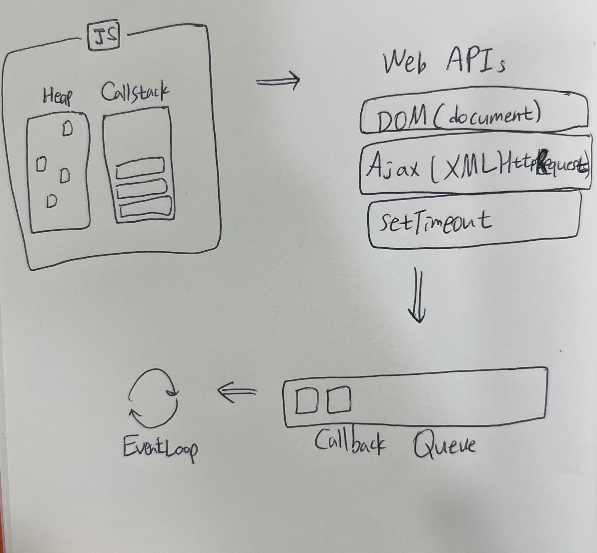

### 목차
1. Js비동기 프로그래밍 이해
2. JS가 비동기 흐름을 처리하는 방식들
3. callback
4. Promise
5. Async/await

# js 비동기 프로그래밍 이해
Javascript 는 단일 스레드(Single-Thread) 언어로, 하나의 Call Stack 만으로 실행 흐름을 제어한다. 즉, 하나의 프로그램은 동시에 하나의 코드만 실행할 수 있다. 하지만 Javascript 는 비동기적으로 작동가능한데, 이는 실행환경(Runtime)과 관련있다. 비동기로 동작하는 핵십요소는 Javascript 가 동작하는 브라우저가 가지고 있다. (node에서는 libuv) 브라우저는 Javascript 엔진 자체가 제공하지 않은 일부 기능인 DOM, AJAX, Web API 등의 기능을 제공한다.

Javascript 런타임을 단순화해서 보았을때, 먼저 메모리 할당이 일어나는 힙과 콜 스택을 볼 수 있다. 하지만, v8내부에는 비동기와 관련된 setTimeout 이나 DOM, HTTP 요청을 관리하는 코드를 볼 수 없다. 브라우저는 Web APIs, Event Table, Callback Queue, Event Loop 등으로 구성되며 자바스크립트 코드가 실행될 때 브라우저와의 동작은 아래 그림을 참고할 수 있다.

- Heap: 메모리 할당이 발생하는 곳
- Call Stack : 실행된 코드의 환경을 저장하는 자료구조, 함수 호출 시 Call Stack 에 push 됩니다.
- Web APIs : DOM, AJAX, setTimeout 등 브라우저가 제공하는 API
- Callback Queue: 이벤트 발생 시 실행해야 할 callback 함수가 Callback Queue에 추가(FIFO로 동작).
- Event Loop
  - Call Stack 과 Callback Queue를 감시.
  - Call Stack 이 비어있을 경우, callback queue에서 함수를 꺼내 Call Stack 에 추가한다.


### 구체적인 동작과정은  해당 유튜브 동영상을 참고했다.

## 동기식 vs 비동기식
동기식과 비동기식 함수 실행 중에 스택을 사용하는 방법에 있어 큰 차이가 존재한다. 동기 함수는 스택이 반환될 때까지 다른 사용자 스택을 점유할 수 없도록 스택을 계속 점유하고 있다. 비동기 함수는 일부 비동기 작업을 다른 곳으로 위임하여 예약된 채로 즉시 반환되며 스택에서 제거된다. 이후 비동기 작업이 완료되면 콜백을 호출받아 해당 콜백함수가 스택을 점유한다.
- 동기식 : 순차적, 직렬적으로 작업(task)를 수행. 어떤 작업이 수행 중이라면 다음 작업은 그 작업이 끝날 때까지 대기. 요청에 대한 결과가 그 자리에서 주어짐(요청에 대한 결과가 동시에 일어난다.)
- 비동기식 : 요청을 보내면 그 요청을 기다리지 않고, 응답에 관계없이 바로 다음 동작이 실행되는 방식.

### 참고자료
- https://www.youtube.com/watch?v=8aGhZQkoFbQ
- https://developer.mozilla.org/ko/docs/Learn/JavaScript/Asynchronous/Concepts
- https://darrengwon.tistory.com/953
- https://hazel-developer.tistory.com/179

# js가 비동기 흐름을 처리하는 방식들
## callback
### callback 패턴의 단점
- 중첩이 되어 복잡도가 높아짐
- 비동기 처리모델은 실행완료를 기다리지 않고 즉시 다음 테스크를 실행하는데, 비동기 함수 내에서 처리 결과를 반환하면 기대한 채로 동작안함. (후속처리가 어려워 비동기 함수의 처리 결과에 대한 처리는 비동기 함수의 콜백 함수 내에서 처리해야함)
- 에러 처리의 어려움

## promise
Promise is a Javascript object for asynchronous operation

Producer 와 Consumer 로 나눠서 생각하면 편하다.

Producer 로 내용은 실행되었지만 결과를 아직 반환하지 않은 객체를 만들고, then을 붙여서 결과를 반환한다. 실행이 완료되지 않았으면 완료된 후에 then 내부 함수가 시행된다.

- Resolve -> then: 성공
- Reject -> catch : 실패
- Finally -> 무조건 실행
```
// 1. Producer
// When new Promise is created, the executor runs automaitcally
const promise = new Promise((relove, reject) => {
  // doing some heavy work(network, read files)
  resolve();
  reject();
});
// 2. Consumer: then, catch, finally
promise
  .then((value) => {
    console.log(value);
  })
  .catch((error) => {
    console.log(error);
  })
  .finally(() => {
    console.log('finally');
  });
```

Promise 는 다음 중 하나의 상태 (State)를 가집니다.
- 대기(pending) : 이행하지도, 거부하지도 않은 초기샅애
- 이행(fulfilled) : 연산이 성공적으로 완료됨.
- 거부 (rejected): 연산이 실패함.

## Promise 생성

Promise 생성자 함수가 인자로 전달받은 콜백 함수는 내부에서 비동기 처리 작업을 수행한다. 이때 비동기 처리가 성공하면 콜백 함수의 인자로 전달받은 resolve 함수를 호출한다. 이때 프로미스는 'fulfilled' 상태가 된다. 비동기 처리가 실패하면 reject 함수를 호출한다. 이때 프로미스는 'rejected' 상태가 된다.

```
const promise = new Promise((resolve, reject)=> {
    //비동기 작업을 수행한다.

    if(/* 비동기 작업 수행 성공 */) {
        resolve('result');
    }
    else { /* 비동기 작업 수행 실패 */
        reject('failure reason');
    }
});
```

### Promise.prototype.then()
then() 메서드는 Promise를 리턴하고 두 개의 콜백 함수를 인수로 받는다. 하나는 Promise 가 resolve 가 되었을 때, 다른 하나는 reject되었을 때를 위한 콜백 함수이다.

만약, 매개변수 중 하나 이상을 생략했거나 함수가 아닌 값을 전달한 경우(then 바롤 이전의 Promise 가 then에 핸들러가 없는 상태로 완료(이행이나 거부)했을 경우), 추가 핸들러가 없는 Promise 가 생성되며, 원래 Promise 의 마지막 상태를 그대로 물려받는다.

```
// p.then(onFulfilled, onRejected);

// p.then(function(value) {
//   // onFulfilled: 이행 값 하나를 인수로 받음
// }, function(reason) {
//   // onRejected: 거부 이유 하나를 인수로 받음
// });

const promise = (idx) =>
  new Promise((resolve, reject) => {
    // 1번
    if (idx % 2 === 0) {
      resolve('짝수');
    } else {
      reject('홀수');
    }
  });

// 2번

promise(testNumber).then(
  // 3번
  function (value) {
    console.log(value); // testNumber가 짝수일 때
  },
  function (reason) {
    console.log(reason); // testNumber가 홀수일 때
  }
);
//4번
```
- 2번 -> 1번 -> 4번 -> 3번순
> 함수가 값을 반환할 경우, then에서 반환한 프로미스는 그 반환값을 자신의 결과값으로 하여 이행합니다. 값을 반환하지 않을 경우, then에서 반환한 프로미스는 undefined 를 결과값으로 하여 이행합니다. 오류가 발생할 경우, then에서 반환한 프로미스는 그 오류를 자신의 결과값으로 하여 거부합니다. 이미 이행한 프로미스를 반환할 경우, then에서 반환한 프로미스는 그 프로미스의 결과값을 자신의 결과값으로 하여 이행합니다. 이미 거부한 프로미스를 반환할 경우, then에서 반환한 프로미스는 그 프로미스의 결과값을 자신의 결과값으로 하여 거부합니다. 대기 중인 프로미스를 반환할 경우, then에서 반환한 프로미스는 그 프로미스의 이행 여부와 결과값을 따릅니다.

***! 주의***

한번 생성된 비동기 인스턴스는 한번만 실행된다. 한번 생성되니 인스턴스에서 여러 번 then문을 실행해도 처음에 결정된 promise 값을 보여준다. 프로미스는 하나인데 등록된 핸들러만 여러개 일 뿐이다. 각각의 핸들러는 순차적으로 실행되지 않고 독립적으로 실행된다.

```
let promise = new Promise(function (resolve, reject) {
  setTimeout(() => resolve(1), 1000);
});

promise.then(function (result) {
  alert(result); // 1
  return result * 2;
});

promise.then(function (result) {
  alert(result); // 1
  return result * 2;
});

promise.then(function (result) {
  alert(result); // 1
  return result * 2;
});
```
### promise error 핸들링
- chaining으로 너무 깊이 가지 말고 중간중간 catch로 에러를 잡기
```
promise //
  .then(cb) //1
  .then(cb) //2
  .then(cb) //3
  .catch(); // 1,2,3번 중 어느 곳에서 발생한지 알기 어려움.

promise //
  .then(cb)
  .catch() // return something else, chainging이 끝까지 실행될 수 있도록  처리
  .then(cb)
  .then(cb);
```

### promise 체이닝과 에러 처리

***! 주의***
```
let promise = Promise.resolve();

promise.then(() => alert('프라미스 성공!'));

alert('코드 종료'); // 이 얼럿 창이 가장 먼저 나타납니다.
```
위의 예시와 같이 Promise 자체가 비동기적으로 작동하지 않는다. 프로미스가 위와 같이 직시 이행 상태가 되어도 '코드 종료' alert이 먼저 뜨고, .then이 나중에 트리거 된다.

> 어떤 프로미스가 준비되었을 때 이 프로미스의 .then/catch/finally 핸들러가 큐에 들어간다고 생각하면 된다. 이때 핸들러들은 여전히 실행되지 않다가 현재 코드에서 자유로운 상태가 되었을 때에서야 자바스크립트 엔진은 큐에서 작업을 꺼내 실행된다.

### promise 병렬처리
- Promise.all
- Promise.allSettled: 실패한 것만 추려낼 수 있음
## async await
- async/await를 통해 비동기 코드를 쓰고 Promise 를 더 읽기 쉽도록 만들어줌.

### 비동기 키워드
async
- function앞에 async 를 붙이면 해당 함수는 항상 프로미스르르 반환
- 프로미스가 아닌 값을 반환하더라도 이행 상태의 프로미스 값을 감싸 이행된 프로미스가 반환
await
- Promise 기반 함수 앞에 써서, Promise 가 fullfil 될때까지 잠시 중단하고, 결과를 반환. 실행을 기다리는 다른 코드들은 중지시키지 않고 그대로 실행.

### 단점
동기식 코드처럼 보이게함. 함수 블럭에 여러 개의 await 키워드를 사용하면 Promise 가 fulfilled 되기전까지 다음 await 를 차단 하기 때문. -> 정의한 함수 내에서는 동기적으로 작동

각 await 는 이전의 작업이 끝날 때 까지 기다림. 하지만 이렇게 하면 동기적인 실행처럼 보임. 기다리는게 아니라 일제히 실행되어야 한다.

### 해결
- 병렬처리

모든 Promise 오브젝트를 변수에 저장하여 미리 실행되게 하고 변수가 사용 가능 할 때 까지 꺼내서 쓰는 것입니다.

```
function timeoutPromise(interval) {
  return new Promise((resolve, reject) => {
    setTimeout(function () {
      resolve('done');
    }, interval);
  });
}

// bad
async function timeTest() {
  await timeoutPromise(3000);
  await timeoutPromise(3000);
  await timeoutPromise(3000);
}
// good
async function timeTest() {
  const timeoutPromise1 = timeoutPromise(3000);
  const timeoutPromise2 = timeoutPromise(3000);
  const timeoutPromise3 = timeoutPromise(3000);

  await timeoutPromise1;
  await timeoutPromise2;
  await timeoutPromise3;
}
```
## 참고자료
- 
- 
- 
- 
- 
- 
- 
- 
- 
