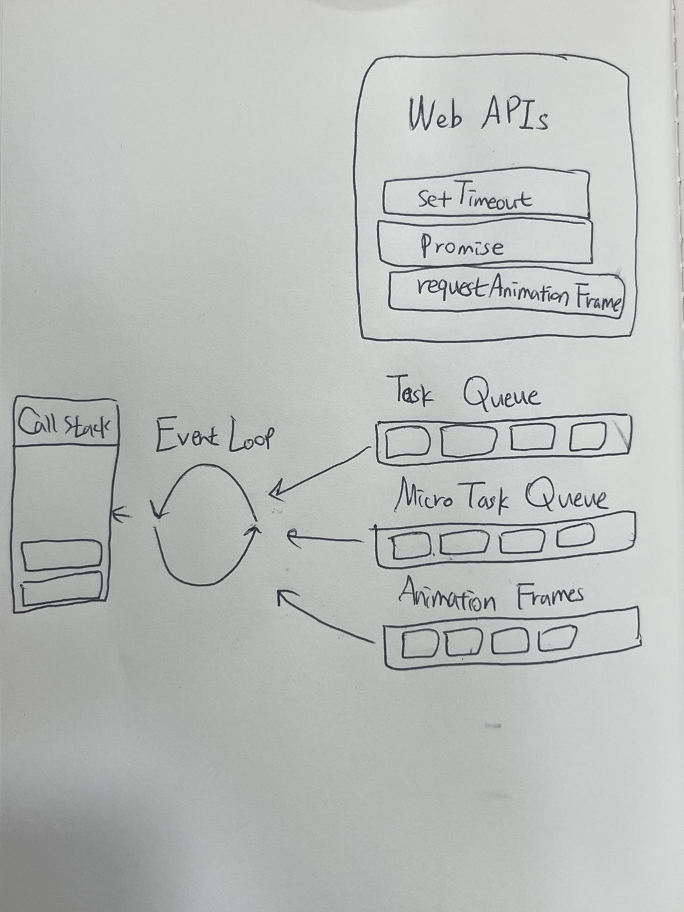

# js엔진 및 브라우저의 구조 이해
# 브라우저마다 엔진이 다르다.
v8 기준으로 설명
## 구성 요소

### Memory Heap
- 메모리 할당이 일어나는 곳
- 구조화되지 않은 넓은 메모리 영역
- 객체(변ㅅ, 함수 등)들이 들어간다.
### Call Stack
- 실행될 코드의 한 줄 단위로 할당(인터프리터이기 때문에)
### Web APIs (노드에서는 백그라운드로 설명)
- 비동기 처리를 담당
### Callback Queue(Task Queue, Event Queue) 등 다양한 형태가 있음
- 비동기 처리가 끝난 후 실행되어야 할 콜백 함수가 차례대로 할당된다.
종류 (Micro > Animation Frames > Task)
- Task Queue(Event Queue) : setTime,
- Microtask Queue (Jon Queue) : promise,
- Animation Frames

### Event Loop
- 이벤트 루프는 테스크가 들어오길 기다렸다가 테스크가 들어오면 이를 처리하고, 처리할 테스크가 없는 경우엔 잠드는, 끊임없이 돌아가는 자바스크립트 내 루프
- Queue에 할당된 함수를 순서에 맞춰 Call Stack에 할당
# 마이크로 테스크와 메크로 테스크 큐

macrotasks
- requestAnimationFrame, I/O, UI rendering, setTimeout, setInterval, setImmediate, mousemove ...
microtasks
- process.nextTick, Promises, queueMicrotask(f), MutationiObserver
- 주로 프로미스를 사용해 만든다. 프로미스와 함께 쓰이는 .then/catch/finally 핸들러가 마이크로 테스크가 된다.
> 자바스크립트 엔진은 매크로테스크 하나를 처리할 때마다 또 다른 메크로 테스크나 렌더링 작업을 하기 전에 마이크로 테스크 큐에 쌓인 마이크로테스크 전부를 처리
 이곳에서 잘 알아보자

### 참고자료
- https://www.youtube.com/watch?v=QFHyPInNhbo
- https://ko.javascript.info/event-loop
- https://velog.io/@yejineee/%EC%9D%B4%EB%B2%A4%ED%8A%B8-%EB%A3%A8%ED%94%84%EC%99%80-%ED%83%9C%EC%8A%A4%ED%81%AC-%ED%81%90-%EB%A7%88%EC%9D%B4%ED%81%AC%EB%A1%9C-%ED%83%9C%EC%8A%A4%ED%81%AC-%EB%A7%A4%ED%81%AC%EB%A1%9C-%ED%83%9C%EC%8A%A4%ED%81%AC-g6f0joxx
- https://jakearchibald.com/2015/tasks-microtasks-queues-and-schedules/