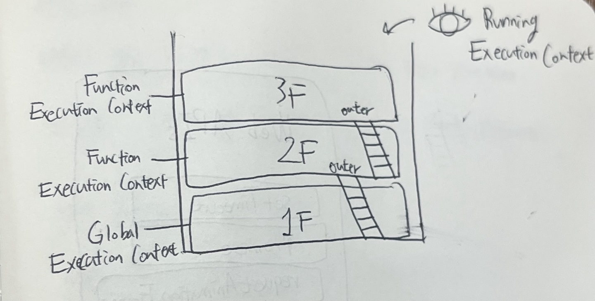

# Scope
> 스코프 체이닝을 이해하기 위해선 해당 폴더의 실행컨텍스트의 ⭐ 표시를 이해할 필요가 있음
모든 식별자(변수명, 함수명, 클래스명 등)은 자신이 선언된 위치에서 다른 코드가 식별자 자신을 참조할 수 있는 유효 범위가 결정된다.

즉, js는 렉시컬 스코프를 따르므로 함수를 어디서 호출 했는지가 아니라 하무를 어디서 정의했는지에 따라 상위 스코프를 설정한다.
- 함수 레벨 스코프(Function-level scope)
- 블록 레벨 스코프(Block-level scope)
> 대부분의 프로그래밍 언어는 블록 레벨 스코프는 따르지만 자바스크립트는 함수 레벨 스코프를 따른다. (ES6는 블록 레벨 스코프를 따르는 변수를 선언하기 위해 let, const 키워드를 제공)

# 식별자 결정
코드에서 변수나 함수의 값을 결정하는 것
콜 스택에 안에 동일한 식별자가 여럿일 때 js엔진이 어떻게 outer 를 활용해서 의사결정을 하는지
> 현재 활성화된 실행 컨텍스트는 하나이지만 이전 렉시컬 환경을 가리키는 Outer Lexical Environment Reference를 타고 이동할 수 있기 때문에 현재 활성화된 실행 컨텍스트에 해당 식별자가 없다면 제일 상위 실행 컨텍스트까지 식별자를 찾아감 (스코프 체이닝)
```
let light = false;
function go2first() {
  let light = true;
  function go2second() {
    let pet = 'puppy';
    console.log(pet); // puppy
    console.log(people); // reference error
    console.log(light); // true: go2first의 light
  }
  go2second();
}
go2first();
```


### 변수 섀도잉
동일한 식별자로 인해 상위 스코프에서 선언된 식별자의 값이 가려지는 현상

### 스코프 체인
식별자를 결정할 때 활용하는 스코프들의 연결리스트

## Closure

### 사전 지식
함수 객체의 내부 슬롯(Environment)

- 함수는 자신의 내부 슬롯에 자신이 정의된 환경(상위 스코프의 참조)를 저장한다.
### closure란
> 클로저란 내부함수에서 외부함수의 지역변수를 사용할 때 외부 함수의 lexical environment 와 함께 bundled 되는 것. 간단히 정리하자면, 자신이 선언된 당시의 환경을 기억하는 함수

예슬 통해서 이해해보자.

```
  const x = 1;
  function outer(){
    const x = 10;
    const inner = function (){
      conosle.log(x);
    }
    return inner;
    // return {
    //   inner(){
    //     console.log(x)
    //   }
    // }
  }
  const hoeun = outer();
  hoeun()l //10
```

⭐outer 함수의 실행컨텍스트는 실행 컨텍스트 스택에서 제거되지만 outer 함수의 렉시컬 환경까지 소명하는 것은 아니다.
따라서, 1) hoeun이라는 전역 렉시컬 환경의 변수는 inner 함수 객체를 가리키고 있고, 2) inner 함수 객체의 내부 슬롯은 outer 함수의 렉시컬 환경을 참조하고 있어서, 3) outer 함수의 렉시컬 환경이 gc의 대상이 되지 않는다.

정리
중첩함수 중 상위 스코프의 식별자를 참조하고 있고, 본인의 외부함수보다 더 오래 살아있다면 클로저로 활용할 수 있다.

### closure의 활용
상태(state)를 안전하게 변경하고 유지하기 위해 사용
상태를 안전하게 은닉하고 특정 함수에게만 상태 변경을 허용하기 위해 사용
아래 예시처럼 makeCounter 함수를 호출해 함수를 반환할 떄마다 함수는 자신만의 독립된 렉시컬 환경을 갖는다.
예시를 통해서 이해해보자 (모던 딥다이브 예제)

```
// 함수를 인자로 전달받고 함수를 반환하는 고차 함수
// 이 함수가 반환하는 함수는 클로저로서 카운트 상태를 유지하기 위한 자유 변수 counter을 기억한다.
function makeCounter(predicate) {
  // 카운트 상태를 유지하기 위한 자유 변수
  var counter = 0;
  // 클로저를 반환
  return function () {
    counter = predicate(counter);
    return counter;
  };
}

// 보조 함수
function increase(n) {
  return ++n;
}

// 보조 함수
function decrease(n) {
  return --n;
}

// 함수로 함수를 생성한다.
// makeCounter 함수는 보조 함수를 인자로 전달받아 함수를 반환한다
const increaser = makeCounter(increase);
console.log(increaser()); // 1
console.log(increaser()); // 2

// increaser 함수와는 별개의 독립된 렉시컬 환경을 갖기 때문에 카운터 상태가 연동하지 않는다.
const decreaser = makeCounter(decrease);
console.log(decreaser()); // -1
console.log(decreaser()); // -2
```

### 참고자료
- https://www.youtube.com/watch?v=EWfujNzSUmw
- https://www.youtube.com/watch?v=PVYjfrgZhtU
- 모던 자바스크립트 딥 다이브
